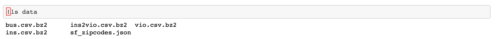
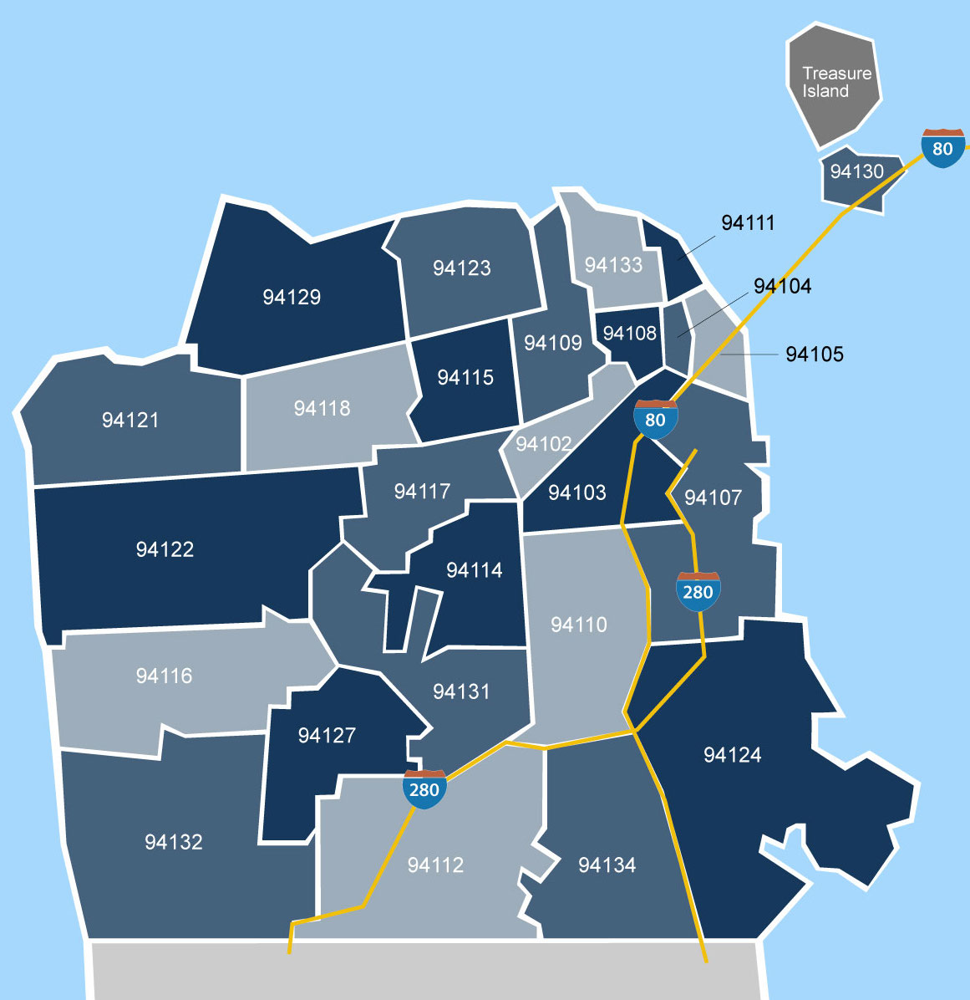

# FoodSafety-Python
Python Data Science Project on analyzing all of San Francisco restaurant's food safety.

## Introduction
In this project, we will investigate restaurant food safety scores for restaurants in San Francisco. The scores and violation information have been [made available by the San Francisco Department of Public Health](https://data.sfgov.org/Health-and-Social-Services/Restaurant-Scores-LIVES-Standard/pyih-qa8i). The project focuses on extensive data explorations and visualizations. The following project inclusdes two notebooks: First notebook focuses on exploring the data and data pre processing while teh second notebook conducts statistical test and visualizations on the modified data.

## Notebooks
  
  ### **FoodSafety.ipynb**
  > In this part of teh subject we work with *[bzip2](https://sourceware.org/bzip2/)* type data files. These data files can be accessed in the *[data](https://github.com/lilitpetrosy/FoodSafety-DS-Python/tree/main/data)* forlder. 
  > *The content of the data folder.*
  > 
  > The next steps are looking into zip codes of the city of San Francisco and determining score association with the location of the restaurats of bus.csv > 
  > dataframe.
  > 
  > Forther data exploration consists of analyzing the Inspections dataframe and combining our modified dataframes together for later use in the coming notebook.
  
  
