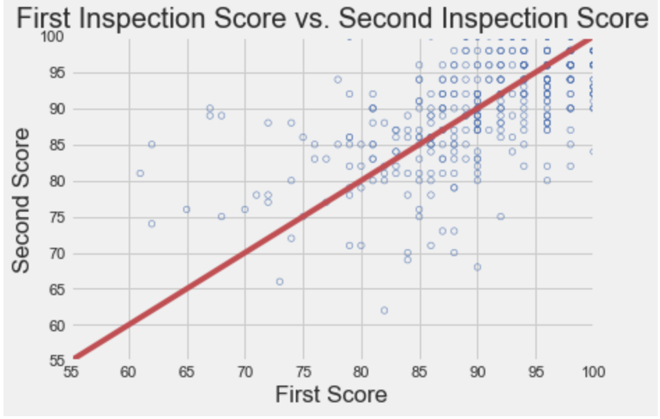
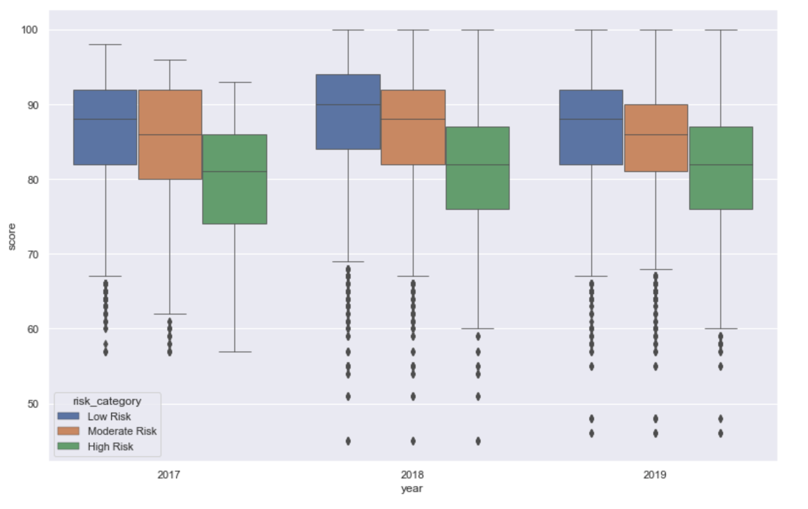
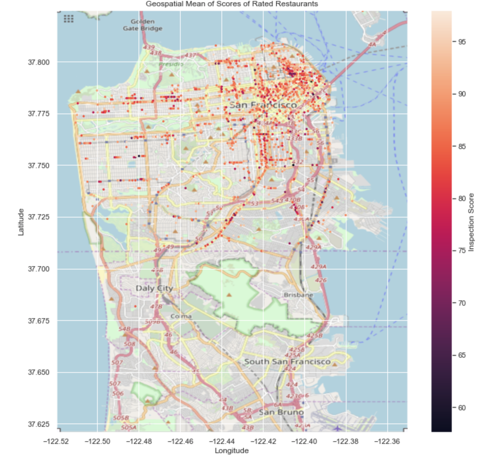

# FoodSafety-Python
Python Data Science Project on analyzing all of San Francisco restaurant's food safety.

## Introduction
In this project, we will investigate restaurant food safety scores for restaurants in San Francisco. The scores and violation information have been [made available by the San Francisco Department of Public Health](https://data.sfgov.org/Health-and-Social-Services/Restaurant-Scores-LIVES-Standard/pyih-qa8i). The project focuses on extensive data explorations and visualizations. The following project includes two notebooks: The first notebook focuses on exploring the data and data pre-processing while the second notebook conducts statistical tests and visualizations on the modified data.

## Notebooks
  
  ### **FoodSafety.ipynb**
  > In this part of the project, we work with *[bzip2](https://sourceware.org/bzip2/)* type data files. These data files can be accessed in the *[data](https://github.com/lilitpetrosy/FoodSafety-DS-Python/tree/main/data)* folder. 
  > *The content of the data folder.*
  > 
  > The next steps are looking into zip codes of the city of San Francisco and determining score association with the location of the restaurants of bus.csv 
  > dataframe.
  > 
  > Further data exploration consists of analyzing the Inspections data frame and combining our modified data frames for later use in the coming notebook.
  
  ### **FoodSafetyB.ipynb**
  > The notebook focuses on finding patterns in the data through data visualizations. Finding correlation between the first score of the restaurant with their 
  > second score.
  > 
  > Additionally, we look at restaurant score distributions over time. The timeline for our comparison is 2017, 2018, and 2019.
  > 
  > Some of our final visualizations include geometric data. In particular, we have included geospatial hexbin plot of average scores of restaurants all over San 
  > Francisco.

Personal note. I have used the map myself when deciding my next restaurant adventure in San Francisco and it has not disappointed me so far  🍜. The plot shows the highest concentration of restaurants with high average restaurant ratings near the Chinatown area.
  > 

I am no food blogger, but if you are interested in good restaurants to dine-in when visiting the Bay Area, here is a [good github list](https://github.com/vahaknp/curations/blob/master/locations/SanFrancisco.md) for you.
